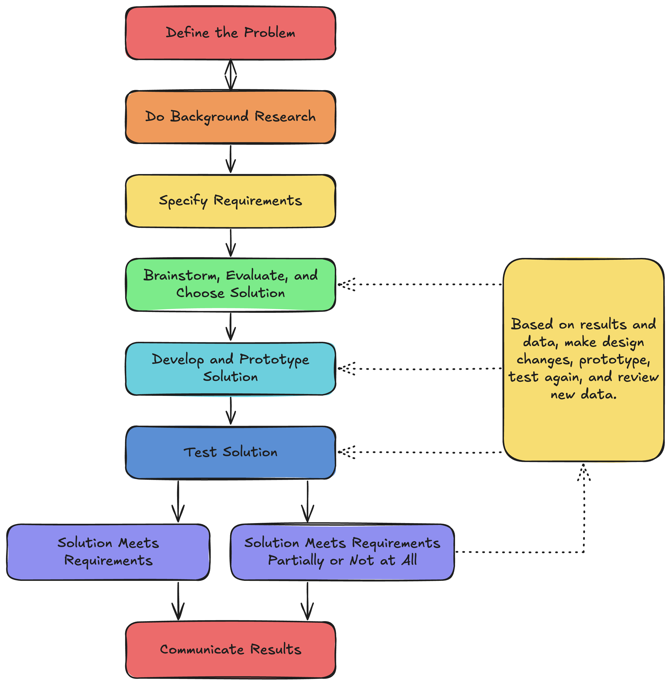

Recently, I've been coming across more and more terms in the AI space that end with "engineering" :

* "AI Engineer"
* "Prompt Engineering"
* "Context Engineering"
* "Harness Engineering"

The list goes on.

\
Seeing all these terms being thrown around relentlessly makes me wonder. How much of the disciplines we consider "engineering" actually are that, and are we leaving anything out? To answer this, I'm going to look into the origin of some of these terms, and if they actually fit the criteria for true "engineering".

## *What* is Engineering?

To my surprise, it is a lot harder than I thought it would be to find a universally agreed upon definition, so you'll get my version of it from what I've gathered (which makes the rest of this subjective, your welcome).\
\
Engineering is, to my understanding, the use of science, math, and creativity to solve problems. Thats it.

## *How* is Engineering?

The Scientific Method is the cornerstone methodology of engineering, and nearly every discipline in the world. \
\
\\
