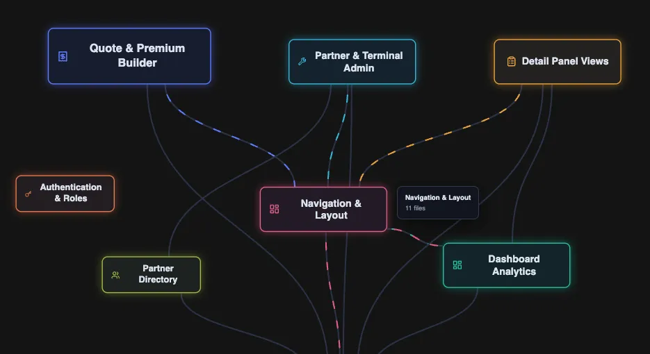

## **I understand it now.**

It took me about six months to understand my company's codebase, and even now, there are minor concepts and components of it that I'm not exactly sure how they work. I wanted to solve this problem and help other developers and product managers understand their system at a high level while being able to go down into the nitty gritty and see how things function in the trenches of their codebase. \
\
I've been really interested in the concept of system design recently due to the  philosophical aspects of it and how those concepts affect the scaling and maintainability of a business. I also think that in the age AI system design expertise is a growing differentiator among software engineers. Building a tool that helps others to understand their system, felt like a passionate and natural next step.

## **What is Sysmap?**

**Repository: [\[link here\]](<link here>)**

Sysmap is a visualization tool that you can run in your codebase's terminal, and it will open up a local process in your web browser visualizing your code base at a high level. This shows you your systems subsystems and how they connect to each other.

* If you click on one subsystem, you can easily see the connections it has within your code base.

  
* You can also recursively go deeper into that system and explore it.
* If you click on a connection, you can see exactly how two subsystems are connected at the file level.
* As a cherry on top, I added a chat window, which lets you communicate with an LLM that has an understanding of your system to let you ask any questions you have about it, and it will respond to you with clear, structured and easy to understand messages breaking down exactly how your system works. Select a subsystem and ask the LLM about it, see what it says.

\
Under the hood, this tool uses Graphify to parse your code base It then takes that structure and generates connections between them. With this structure and Connections, we create subsystems. If a particular group of files is heavily connected, they're classified as a subsystem. We then take these subsystems, connections, and structure and visualize them using React and that is what you see today. We take an LLM and we have it name these subsystems as well as assign an icon to it to aid visual understanding.

\
Here are some of the research articles that I based the initial exploration and aspects of the implementation of this project on:

* [The effect of worked examples on learning solution steps and knowledge transfer](https://www.tandfonline.com/doi/full/10.1080/01443410.2023.2273762)
* [A Layered Software City for Dependency Visualization](https://www.scitepress.org/Papers/2021/101802/101802.pdf)
* [Clustering for Software Remodularization by Using Structural, Conceptual and Evolutionary](https://lib.jucs.org/article/23783)
